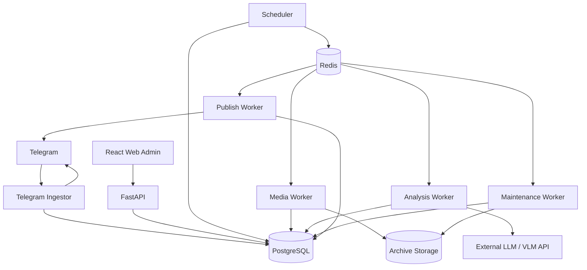
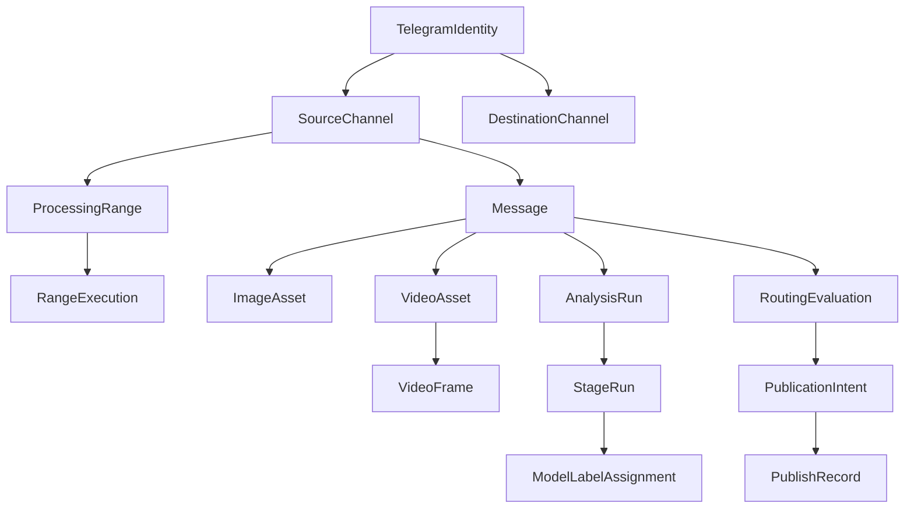
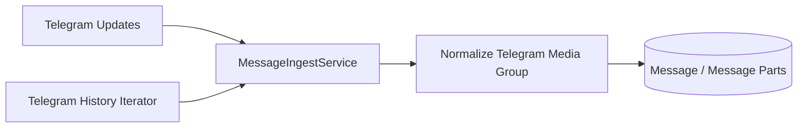
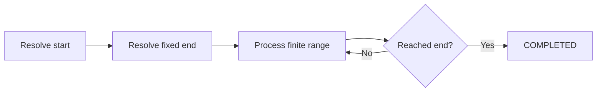
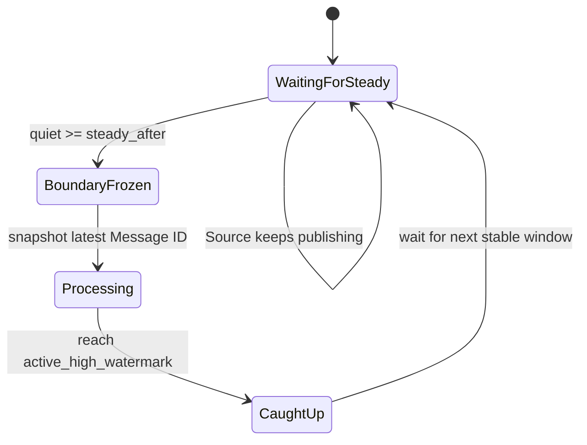
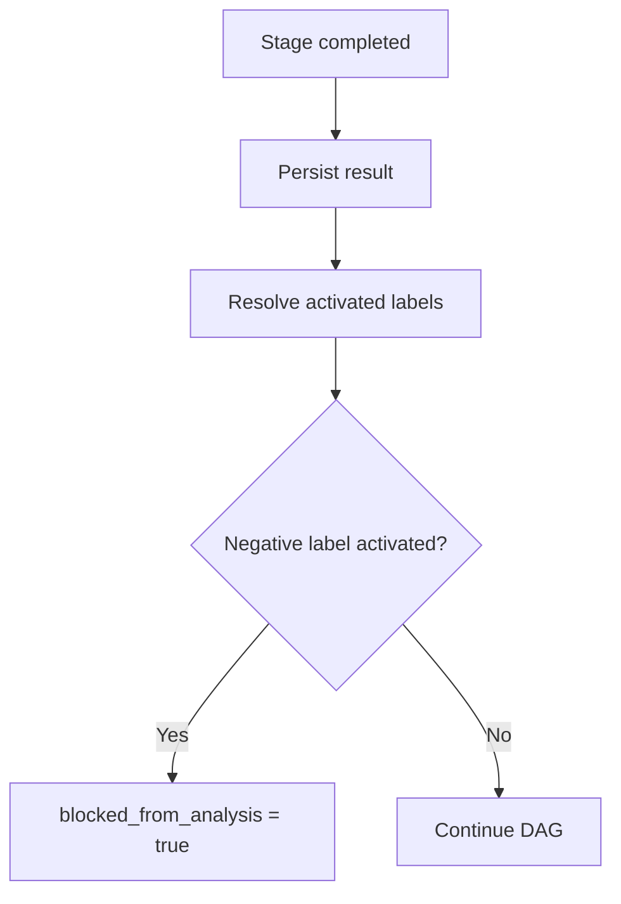
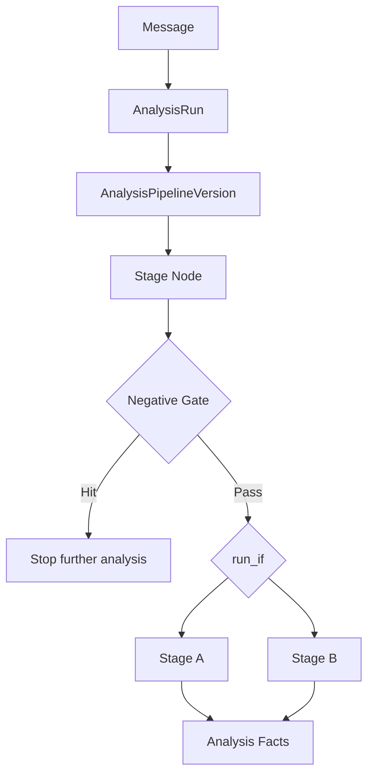
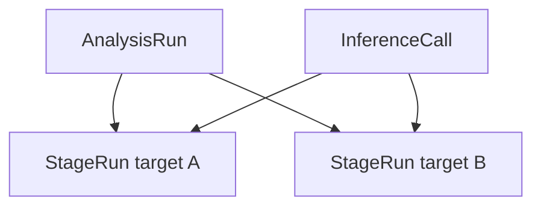
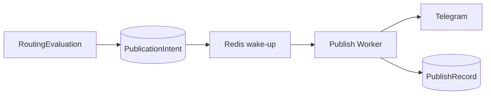
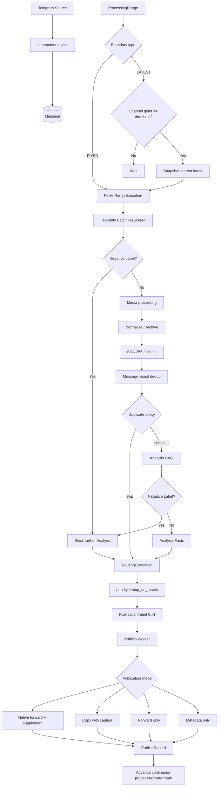

# TG VLM Curator 完整架构设计

文档用途：TG VLM Curator 首版实现的系统架构规范，面向 Coding Agent、开发者和后续维护者。

本文定义系统的领域模型、Telegram 摄入与处理范围、媒体归档与去重、Analysis Engine、Prompt 与 Structured Output、Negative Label、Routing、Telegram Publishing、Web 管理、持久化、运行时、可靠性、安全、部署和测试约束。本文中的实体名称和接口边界可以在实现时做符合语言习惯的微调，但文中明确标记为架构不变量的语义不得改变。

## 1. 系统目标与约束

TG VLM Curator 是一个长期运行的 Telegram 内容摄入、分析、分类、审核和路由系统。系统面向约 10～100 个来源频道、每天数千至数万条逻辑消息的中等规模部署。它持续从 Telegram 获取消息，根据频道配置对消息执行文本预筛、媒体处理、LLM/VLM 多阶段分析、标签生成和规则路由，并将满足条件的消息通过不同发布模式发送到一个或多个目标频道。

系统以外部 LLM/VLM HTTP API 作为推理能力来源。模型服务不由 TG VLM Curator 的 Docker Compose 编排，系统只消费版本化 `InferenceProfile` 所描述的外部接口。因此同一套部署可以连接本机 LM Studio、远程 vLLM、云端 API 或其他兼容 Provider，而不改变核心业务架构。

系统只有一个业务处理单位：`Message`。一条 Message 可以包含文本、若干图片和若干视频。Telegram 原生 Album / Media Group 可以在摄入层规范化为一条逻辑 Message，但系统不执行跨 Message 内容聚合，也不尝试判断连续发布的多个 Message 是否属于同一资源。

系统中的 `Batch` 只是一种运行时中间结构，用于数据库分片读取、批量文本分析或批量媒体推理。管理员不会创建或维护 Batch，Batch 不拥有独立业务生命周期。

系统默认长期保留标准化后的视觉归档，用于人工复核、Prompt 测试、历史分析和模型评估。同时提供可组合过滤、Dry Run 和完整审计的人工清理机制。

首版采用单管理员 Web 后台，不实现复杂 RBAC。系统需要完整审计关键管理操作和外部副作用，并能够在 Docker Compose 整体重启、Redis 丢失、Worker 崩溃、Telegram 或模型 API 暂时不可用后继续工作。

## 2. 总体架构

整体采用模块化单仓库和多服务运行方式。PostgreSQL 是唯一业务真源；Redis 用于 Celery 队列、短期协调和唤醒；媒体归档位于独立 Storage 层；Telegram 和外部 LLM/VLM 均通过 Adapter 与领域层隔离。



推荐后端技术栈为 Python 3.12+、FastAPI、Pydantic v2、SQLAlchemy 2、asyncpg、Alembic、Celery、Redis、Telethon、httpx、Pillow 和 FFmpeg/ffprobe。前端推荐 React + TypeScript + Vite。PostgreSQL 推荐 16 或更高版本。Web 是管理型应用，不要求 SSR，首版也不依赖 WebSocket，运行状态可以通过轮询或增量查询完成。

所有常驻 Python 服务尽量使用同一个 Backend Image，只通过启动命令区分 API、Ingestor、Scheduler 和不同队列的 Worker，减少镜像和依赖漂移。

## 3. 核心领域模型

系统最重要的领域对象包括 `TelegramIdentity`、`SourceChannel`、`DestinationChannel`、`ProcessingRange`、`RangeExecution`、`Message`、`ImageAsset`、`VideoAsset`、Analysis 相关版本与运行实体、Routing 相关版本与运行实体，以及归档和审计实体。



### 3.1 TelegramIdentity

`TelegramIdentity` 统一表示 MTProto 用户账户和 Telegram Bot：

```text
TelegramIdentity
- id
- name
- type: MTPROTO_USER | BOT
- enabled
- health_status
- last_connected_at
- last_error
- secret_reference
```

MTProto User 是首版主要读取身份，承担来源频道历史读取、Updates、媒体下载、原生 Forward 和 Reconciliation。Bot 更适合作为发布身份，但系统不把能力与身份类型硬编码等价，而是通过 `TelegramCapabilityResolver` 显式判断某个身份是否具备 `can_read_source`、`can_download_source_media`、`can_native_forward`、`can_upload_media`、`can_send_message` 和 `can_access_destination` 等能力。

### 3.2 SourceChannel

`SourceChannel` 表示一个受系统管理的 Telegram 来源频道。它保存稳定 Peer 信息、默认读取身份、活动配置引用以及动态观测状态：

```text
SourceChannel
- id
- telegram_peer_id
- username
- display_name
- default_read_identity_id
- active_profile_version_id
- enabled
- last_activity_at
- latest_seen_message_id
- created_at
- updated_at
```

`last_activity_at` 和 `latest_seen_message_id` 主要服务于 `end_at = latest` 的动态右边界解析。实时 Update 只负责及时发现消息和更新观测状态，不等于立即执行重型处理。

### 3.3 DestinationChannel

来源与目标角色分开建模：

```text
DestinationChannel
- id
- name
- telegram_peer
- default_publish_identity_id
- enabled
```

同一个 Telegram Channel 在技术上可以同时作为 Source 和 Destination，但业务配置仍保持两个角色，以避免摄入策略与发布策略耦合。

### 3.4 Message

`Message` 是唯一业务处理单位。普通 Telegram 消息对应一个 Message；同一个 `grouped_id` 的原生 Media Group 在 Ingest 层被规范化成一个逻辑 Message。

建议结构：

```text
Message
- id
- source_channel_id
- telegram_message_ids[]
- telegram_grouped_id
- primary_telegram_message_id
- published_at
- edited_at
- original_text
- telegram_metadata
- processing_status
- review_status
- media_fingerprint
- canonical_message_id
- duplicate_status
- blocked_from_analysis
- blocked_by_label_assignment_id
- source_revision
- source_changed_after_processing
- source_deleted
- source_deleted_at
- created_at
- updated_at
```

`telegram_message_ids[]` 允许一个逻辑 Media Group 对应多个 Telegram 底层 Message ID。跨 Message 内容关联不属于系统能力。

## 4. Telegram 摄入与 Message 规范化

实时 Update 和历史读取必须进入同一个 `MessageIngestService`：



系统内部不存在“实时消息模型”和“历史消息模型”。同一 Telegram 消息无论通过 Update 还是历史扫描再次遇到，都执行幂等 Upsert。

普通消息的稳定身份由 Telegram 来源 Peer 和 Message ID 决定。Media Group 以来源 Peer、`grouped_id` 和实际组成 Message ID 进行规范化，并应允许在一个短暂聚合窗口内等待同一 Telegram Media Group 的底层 parts 到齐。这只是 Telegram 原生消息规范化，不属于跨业务 Message 聚合。

Telegram Ingestor 长期连接 Update，但完整性不能只依赖实时连接。它维护同步位置，重连后对 `last_seen_message_id` 附近执行短范围 History Reconciliation。ProcessingRange 在真正要求处理某个区间时，也可以补抓数据库中缺失的 Telegram History。重复读取是安全行为，因为摄入是幂等的。

## 5. ProcessingRange：统一历史与持续处理

系统使用单一 `ProcessingRange` 抽象表达“某个来源频道中的哪些 Message 应进入处理流水线”。历史存量和未来新增消息共享同一个 Range Executor，不存在独立的 Backfill Pipeline 和 Realtime Processing Pipeline。

```text
ProcessingRange
- id
- source_channel_id
- start_at
- end_mode: FIXED | LATEST
- end_at
- resolved_start_message_id
- resolved_fixed_end_message_id
- processing_watermark
- active_high_watermark
- steady_after_seconds
- status
- enabled
- created_at
- updated_at
```

管理员使用时间表达业务边界，例如：

```yaml
processing_range:
  start_at: "2026-01-01T00:00:00+08:00"
  end_at: "2026-08-31T23:59:59+08:00"
```

或者：

```yaml
processing_range:
  start_at: "2026-01-01T00:00:00+08:00"
  end_at: latest
  steady_after_minutes: 10
```

时间边界应尽快解析成 Telegram Message ID。实际恢复和水位推进以 Message ID 为主，避免时间戳精度和同秒多消息造成游标歧义。

### 5.1 FIXED 右边界

`FIXED` 表示一个确定历史区间。起止边界被解析后，执行器可以连续处理直到终点。频道当前是否正在发布新消息与这个范围无关，稳态机制不适用于 FIXED Range。



### 5.2 LATEST 动态右边界

`LATEST` 表示右边界会随频道未来消息增长。它是符号边界，不意味着 Worker 永远追着最新消息逐条处理。

系统只在频道连续无更新达到 `steady_after` 时，才把此刻 Telegram 上的最新 Message ID 冻结为新的 `active_high_watermark`。冻结后得到一个普通有限区间：

```text
(processing_watermark, active_high_watermark]
```



稳态只控制 `LatestBoundaryResolver` 是否允许推进新的动态右边界。已经冻结的处理窗口不会因为随后出现新消息而暂停、扩大或改变。新消息只属于下一次稳态后产生的新窗口。

在冻结之前，Resolver 应主动查询 Telegram 当前最新消息，并结合它的实际发布时间或可靠观测时间确认频道已经满足静默阈值，避免仅依赖可能经历过重连的内存 Update 状态。

### 5.3 RangeExecution

每次实际解析出的有限执行窗口持久化为：

```text
RangeExecution
- id
- processing_range_id
- from_message_id_exclusive
- to_message_id_inclusive
- source_profile_version_id
- status
- created_at
- started_at
- completed_at
```

例如一个持续范围可以形成：

```text
RangeExecution 1: (10000, 10320]
RangeExecution 2: (10320, 10487]
RangeExecution 3: (10487, 10612]
```

`RangeExecution` 用于恢复、审计和冻结配置快照。它不是管理员创建的 Batch。

### 5.4 Processing Watermark

`processing_watermark` 代表已经连续进入合法终态的最高 Message ID。并行 Worker 可以使后方 Message 先完成，但 Watermark 不能越过中间尚未终结的 Message。

例如：

```text
1001 COMPLETED
1002 FAILED_RETRYABLE
1003 COMPLETED
1004 COMPLETED
```

Watermark 仍为 `1001`。只有 1002 最终完成或管理员明确标记为合法 Skip 后，Watermark 才可以一次推进到 1004。

合法终态可以包括正常完成、Negative Gate 阻断、重复策略跳过、配置决定无需运行、明确的永久 Unsupported 状态和管理员审计过的 Skip。临时失败不属于完成。

## 6. Batch：纯运行时中间结构

Batch 不属于领域模型。RangeExecution 得到一段待处理 Message 后，各阶段可以按自身约束临时切片。

例如数据库可以一次读取 500 条 Message，Text PreScreen 每次向模型发送最多 64 条，MEDIA `batch_assets` 每次最多 8 个 Asset。实际批量大小由配置值、模型输入 Token 限制、图片数量、像素预算和请求体大小共同决定。

```text
ProcessingRange = 业务选择范围
RangeExecution  = 冻结后的有限执行窗口
Message         = 唯一业务处理单位
Batch           = 临时执行优化
```

Batch 不需要管理员 CRUD，也不要求为每个批次建立复杂业务页面。真实外部模型请求由 `InferenceCall` 记录，足以承担调试和成本审计。

## 7. Text-only PreScreen 与 Negative Label

Message 在任何重型媒体处理之前可以进入一个低成本纯文本 Analysis Stage。它只使用 Message ID、来源频道、文本/Caption、发布时间和必要 Telegram Metadata，不下载图片或视频。

典型 Stage：

```yaml
name: text_prescreen
target_scope: GLOBAL
execution_mode: batch_messages
input:
  text: true
  telegram_metadata: true
  media: false
  previous_results: false
batch_size: 64
```

一个模型请求可以批量处理 N 条 Message，并通过稳定 `message_id` 返回结构化结果。这样大量历史消息可以先剔除依靠文本已经足以判断的无效内容，从而节约 Telegram 媒体下载、FFmpeg、VLM 图像 Token 和 GPU 推理成本。

任何 GLOBAL 或 MEDIA `LabelDefinition` 都可以标记为 Negative。Negative Label 的固定语义是：当标签达到所在 Stage 的激活阈值后，其父 Message 停止参加剩余 Analysis DAG。



MEDIA Stage 中任意 ImageAsset 或 VideoAsset 命中 Negative Label，也会阻断整个父 Message 的后续 Analysis。系统保存 `blocked_at`、`blocked_by_stage_run_id` 和 `blocked_by_label_assignment_id`，剩余 StageRun 标记为 `SKIPPED_NEGATIVE_GATE`。

Negative Gate 只控制后续 Analysis，不自动删除 Message，也不自动禁止 Routing/Publishing。Routing Engine 可以根据 Negative Labels、`blocked_from_analysis` 和其他事实决定是丢弃、发送到特殊频道还是只记录。

## 8. 媒体模型与处理流水线

只有通过 Text PreScreen 和初始 Negative Gate 的 Message 才需要进入重型媒体阶段。

```text
Message
├── ImageAsset[]
└── VideoAsset[]
    ├── Cover
    └── RepresentativeFrames[]
```

`ImageAsset` 保存 Telegram 来源引用、尺寸、MIME、SHA-256、感知哈希、归档状态和 Storage Key。`VideoAsset` 保存视频元数据、封面和最终代表帧。视频帧本身是 VideoAsset 的分析证据，不默认成为独立业务分类对象。

### 8.1 图片标准化

长期归档的视觉资产统一转换为配置规定的 WebP。`MediaProcessingProfileVersion` 控制最长边、Quality、是否保留 Metadata、目标格式等。原始 Telegram 大文件只作为临时 Processing Artifact，不要求永久保存。

### 8.2 视频自适应抽帧

视频首先使用 ffprobe 获取时长和基本元数据，再根据时长生成候选时间点，通过 FFmpeg 抽帧，使用 pHash 或等价视觉相似性方法去掉近重复帧，最后保留有限数量代表帧。


典型配置：

```yaml
video_sampling:
  min_candidate_frames: 6
  max_candidate_frames: 24
  max_representative_frames: 6
  min_temporal_gap_seconds: 2
  phash_distance_threshold: 8
  keep_cover: true
```

候选阶段被过滤掉的图片不长期归档。长期保存视频封面和最终代表帧。

## 9. Message 级视觉去重

系统需要识别相同视觉素材在同一频道或多个频道中的重复发布，同时保留每条 Telegram Message 自己的来源、文本、时间和路由历史。

每张原始图片与每个视频封面计算：

```text
SHA-256
perceptual_hash
perceptual_hash_algorithm
```

SHA-256 用于字节级完全一致；感知哈希用于容忍重新编码、缩放、轻度压缩和小型视觉变换。

Message 的视觉身份严格根据所有原始图片与所有视频封面的感知哈希构成无序 multiset：

```text
VisualFingerprint = unordered_multiset(
    image_phashes + video_cover_phashes
)
```

Message 文本、媒体排列顺序、来源频道和视频 Representative Frames 不参与 Message 级重复身份。multiset 保留重复素材数量信息。

发现重复后保存：

```text
canonical_message_id
duplicate_status
duplicate_match_score / distance
```

每个来源 Profile 支持至少两种 Duplicate Policy：

`skip`：记录当前 Message 及重复关系，不再执行模型分析和正常路由。

`reclassify_with_text`：复用可以安全复用的纯视觉 MEDIA 结果，以当前 Message 自己的文本重新执行依赖文本的 GLOBAL 和下游 Stage，并重新计算 Routing。

重复复用必须由 Stage Cache Policy 决定，不能只因为图片相似就无条件复用旧模型输出。

## 10. Analysis Engine 总体模型

Analysis Engine 的边界从“Message 已具备分析资格”开始，到“产生完整 GLOBAL/MEDIA 分析事实并进入终态”结束。它不负责 Telegram 摄入，也不决定最终目标频道。

每个来源频道通过活动 `SourceChannelProfileVersion` 引用确定的 `AnalysisPipelineVersion`。Pipeline 是条件 DAG；节点引用可复用的 `AnalysisStageTemplateVersion`；所有会改变历史结果解释方式的配置均版本化。



## 11. LabelDefinition 与 LabelSet

Label 是数据，不是 Python Enum。业务分类不得硬编码进核心程序。

```text
LabelDefinition
└── LabelDefinitionVersion
    - key
    - display_name
    - description
    - scope: GLOBAL | MEDIA
    - negative
    - enabled
```

标签默认采用纯 Multi-label 语义，不要求互斥，也不设置固定主类别。

Stage 不直接引用数据库“所有标签”，而引用一个确定 `LabelSetVersion`：

```text
LabelSetVersion
└── LabelBinding[]
    - label_definition_version_id
    - activation_threshold
    - prompt_hint
    - output_order
```

`LabelBinding.activation_threshold` 决定某个分数何时被视为 Activated Label。模型原始分值永久保留，后续可以在不覆盖历史输出的情况下重新计算阈值语义。

GLOBAL 标签属于整条 Message；MEDIA 标签属于某个 ImageAsset 或 VideoAsset。一个视频的 MEDIA 标签代表视频整体，Representative Frames 只是输入证据。

## 12. AnalysisStageTemplate 与 Pipeline DAG

Stage 使用版本化模板：

```text
AnalysisStageTemplate
└── AnalysisStageTemplateVersion
    - name
    - target_scope
    - execution_mode
    - prompt_version_id
    - label_set_version_id
    - structured_output_policy
    - input_policy
    - visual_composition_policy
    - inference_profile_version_id
    - cache_policy
    - timeout
    - retry_policy
    - concurrency_policy
```

Pipeline Node 引用 Published Stage Version，并可以对白名单参数做局部 Override。改变 Prompt、LabelSet、target_scope 或 Structured Output 核心语义时应创建新的 Stage Version；帧数、阈值、Timeout 等有限运行参数可以作为显式允许的 Override。

DAG 节点保存 `depends_on` 和 `run_if`。Pipeline 发布前必须验证无环、依赖完整、标签引用合法、作用域兼容和条件表达式可解析。

```yaml
run_if:
  all:
    - fact: global.real_ugc
      op: gte
      value: 0.70
    - fact: message.blocked_from_analysis
      op: eq
      value: false
```

Analysis Engine 将各 Stage 结果规范化为 `AnalysisFacts`，后续条件只读取稳定 Facts，不直接解析各 Stage 的原始 JSON。

## 13. Execution Mode 与输入组合

`target_scope` 表示分析对象，`execution_mode` 表示如何组织模型请求，两者独立。

首版支持：

- `batch_messages`：一次请求分析 N 条 Message，主要用于 Text PreScreen。
- `single_message`：一次请求分析一个 Message，适合复杂 GLOBAL Stage。
- `per_asset`：一次请求分析一个 ImageAsset 或 VideoAsset。
- `batch_assets`：一次请求分析多个媒体对象，输出必须通过稳定 `asset_id` 映射。

一个 VideoAsset 即使拥有多张 Representative Frames，在 `per_asset` 模式下仍然只是一项业务分析目标，可以把这些帧作为多图输入或 Contact Sheet 一次送给模型。

## 14. Prompt 独立版本化

Prompt 使用独立版本实体：

```text
PromptTemplate
└── PromptTemplateVersion
    - system_prompt
    - user_prompt_template
    - declared_variables
    - status: DRAFT | PUBLISHED | ARCHIVED
```

Published Prompt 不允许原地修改。编辑已发布 Prompt 会生成新的 Draft Version。

允许的受控变量包括：

```text
{{ label_definitions }}
{{ message_text }}
{{ asset_manifest }}
{{ previous_results }}
{{ source_channel_context }}
```

变量由 Stage Input Policy 决定是否存在。Prompt 不能执行任意 Python，也不能访问数据库对象、环境变量或文件系统。

`{{ label_definitions }}` 根据当前 LabelSetVersion 自动生成，因此新增或调整业务标签不需要修改核心代码。

## 15. Structured Output

Structured Output Schema 由 `StageTemplateVersion + LabelSetVersion + execution_mode + structured_output_policy` 动态生成，不手工写死业务标签。

首版支持两种标签输出模式。

`dense_scores` 要求模型对当前 Stage 的所有候选标签输出 0～1 分值，是默认推荐模式。它便于后续调整阈值、模型评估、人工审核和历史统计。

`sparse_matches` 只返回模型认为匹配的标签与置信度，适合候选类别很多且希望减少输出 Token 的 Stage，但未返回标签无法区分“低概率”和“模型遗漏”。

Stage 可以可选要求 `reason` 和 `evidence`，默认关闭以控制输出成本。

对于 `batch_messages`，Schema 必须要求 `message_id`；对于 `batch_assets`，必须要求 `asset_id`。Validator 根据期望 ID 集合检查未知 ID、重复 ID、缺失结果和 Schema 错误。

每一次真实模型调用都保存当次完整 JSON Schema 快照及其 Hash，而不只记录一个抽象版本号。

## 16. Visual Input、Contact Sheet 与 InputManifest

视觉输入策略与 Execution Mode 独立，建议支持：

```text
raw
contact_sheet
adaptive
```

Contact Sheet 是推理派生资产，不替代标准化归档图片或视频代表帧。拼图必须带稳定区域标识，例如 `A01`、`F01`，Prompt 中同步提供映射。系统根据 `max_items_per_sheet`、最长边、总像素和最大 Sheet 数自动拆分。

每个 Stage 在调用模型前生成不可变 `InputManifest`，记录实际目标、文本、图片、视频代表帧、Contact Sheet、前序 Analysis Facts、Prompt Version、Structured Output Schema 和必要 Provider 参数，并计算 `input_manifest_hash`。

因此历史任务可以精确回答“模型当时实际看到了什么”，而不是只知道 Message 理论上包含哪些媒体。

## 17. Stage Cache

Stage Cache 必须显式声明复用范围。首版建议：

```text
none
message
message_visual
asset
```

`none` 每次重新调用模型；`message` 绑定当前 Message 和完整 InputManifest；`message_visual` 用于只依赖整条 Message 视觉内容的 Stage；`asset` 用于纯 MEDIA 分析。

Cache Key 至少考虑：

```text
cache scope identity
stage_template_version
prompt_version
label_set_version
structured_output_schema_hash
inference_profile_version
input_manifest_hash
```

复用结果必须记录 `result_origin = inference | cache` 和 `reused_from_stage_run_id`。视觉内容相同本身不足以证明旧结果在新的 Prompt、LabelSet 或模型版本下仍可复用。

## 18. InferenceProfile 与 Provider Adapter

`InferenceProfileVersion` 描述外部模型服务：

```text
provider adapter
base_url
model_name
api_secret_reference
capabilities
timeout
max_concurrency
max_images
max_input_tokens
structured_output_support
sampling_parameters
```

首版优先实现 `OpenAICompatibleInferenceProvider`，但 Analysis Engine 不依赖其具体 HTTP 协议。后续可以增加其他 Adapter。

外部模型服务完全位于 Compose 之外。模型 API Key 通过 Secret Reference 获取，不进入普通配置 JSON。

## 19. AnalysisRun、StageRun 与 InferenceCall

一次 Message 执行某个 Pipeline 时创建 `AnalysisRun`；每个实际业务分析目标产生 `StageRun`；一个网络请求由 `InferenceCall` 表示。



这允许 `batch_messages` 或 `batch_assets` 中一个 HTTP 请求同时承载多个业务 StageRun，同时保持业务目标和网络调用审计解耦。

`InferenceCall` 记录 Provider、模型、请求摘要、Token Usage、Latency、HTTP 状态、Retry Attempt 和原始响应。`StageRun` 记录 InputManifest、解析结果、错误状态和实际版本引用。

批量请求允许 Partial Failure。若 64 个目标中只有一个缺失结果，其他合法目标可以正常提交，缺失目标单独进入 Retry，不要求整个 Batch 重跑。

只有 Structured Output 完成 Schema 和 Target Mapping 验证后，才允许创建正式 `ModelLabelAssignment`。

## 20. 模型标签、人工标签与 Effective Labels

模型结果和人工结果永久分离：

```text
ModelLabelAssignment
ManualLabelAssignment
EffectiveLabels
```

人工操作不得覆盖历史模型输出。业务层根据人工 override 规则动态得到 Effective Labels，同时保留模型原始分值、人工变更和当前有效结果。

一个正在运行的正式 AnalysisRun 默认只读取该 Run 内稳定的模型事实。管理员在运行途中修改人工标签，不会让旧 Run 静默改变 DAG 路径。需要依据人工标签重新分析时显式创建新的 ReanalysisRun。

所有历史 Message 都可以 Review。`review_status` 只是筛选状态，不决定是否有复核资格。

## 21. Reanalysis 与 Prompt Test Bench

历史 Message 可以由于模型更换、Prompt 更新、LabelSet 更新、Pipeline 变化、失败恢复或管理员主动操作创建新的 AnalysisRun。已有 WebP、视频代表帧、pHash 和满足 Cache Policy 的旧 Stage 结果可以复用，新 Run 不删除旧 Run。

Web 提供 Prompt Test Bench。管理员可选择历史 Message / ImageAsset / VideoAsset，以及 Prompt、LabelSet、Stage、InferenceProfile 和 Structured Output 模式进行旁路测试，并查看最终渲染 Prompt、视觉输入、JSON Schema、原始模型响应、解析结果、Token Usage 和 Latency。

Test Run 不修改正式标签、不触发 Negative Gate、不推进 Processing Watermark、不触发 Routing，也不执行 Telegram Publish。

## 22. Routing Engine

Routing Engine 是纯确定性规则系统。它不调用 LLM，也不改变模型标签。

输入为一次 Routing Evaluation 时的事实快照：Message Metadata、GLOBAL/MEDIA Labels、Negative Labels、`blocked_from_analysis`、Duplicate 状态、Review 状态，以及 `model`、`manual`、`effective` 三个标签命名空间。输出是 0..N 个 Routing Actions。

`RoutingPolicyVersion` 包含有序 `RoutingRule[]`。Published Policy 不可原地修改。

每条规则至少包含：

```text
priority
enabled
condition
stop_on_match
actions[]
```

规则固定按 `priority DESC, rule_id ASC` 执行。命中后若 `stop_on_match = true`，停止后续低优先级规则；否则继续，因此同一 Message 可以进入多个目标频道。

## 23. Routing Condition DSL

规则使用声明式条件树，不允许管理员运行 Python、SQL 或任意脚本。

```yaml
condition:
  all:
    - label:
        namespace: effective
        scope: global
        key: real_ugc
        score_gte: 0.80
    - any_media:
        label:
          namespace: effective
          key: some_media_label
          score_gte: 0.75
    - not:
        label:
          namespace: effective
          scope: global
          key: advertisement
```

首版至少支持 `all`、`any`、`not`、GLOBAL Label、`any_media`、`none_media`、Message Fields、Source Channel、Duplicate State、`blocked_from_analysis` 和 Review Status。分值比较支持 `gt/gte/lt/lte/eq`。

标签 Namespace 必须显式指定为 `model`、`manual` 或 `effective`，避免人工覆盖后规则语义不清。

每次正式 Routing 保存 `RoutingEvaluation`，包含 Policy Version、Facts Snapshot、Facts Hash、实际检查和命中的 Rule，以及 `stopped_at_rule_id`。历史标签变化不回写旧 RoutingEvaluation。

## 24. RenderingTemplate

发布补充文本、重新生成 Caption 和 Metadata Message 都通过版本化 RenderingTemplate 管理。推荐使用 Jinja2 Sandboxed Environment + StrictUndefined。

模板只能读取显式暴露的上下文，例如 Message Text、Source、GLOBAL/MEDIA Labels、Model/Manual/Effective Labels、Duplicate、`blocked_from_analysis`、Telegram Source Link 和 Media Count。禁止文件系统、网络、环境变量和任意对象属性遍历。

实际渲染后的文本也要保存快照和 Hash，使历史 Publish 不依赖当前模板内容。

## 25. 四种 Publication Mode

首版完整支持四种发布模式。

### 25.1 native_forward_with_supplement

使用 Telegram 原生 Forward 发送完整原消息或 Media Group，再发送系统生成的 Supplemental Message，并可配置为回复刚刚 Forward 的目标消息。这是默认推荐模式，因为它尽量避免大视频重新上传，同时保留系统生成标签和说明。

### 25.2 copy_with_caption

系统重新发送媒体，并使用 Rendering Template 生成新的 Caption。媒体优先复用当前处理过程仍存在的原始临时文件；否则重新从 Telegram 来源下载；若只剩长期归档而归档中没有原视频，则历史视频 Copy 可能无法完成。

### 25.3 forward_only

只执行 Telegram 原生 Forward，不追加任何系统生成文本。

### 25.4 metadata_only

不发送原始媒体，只发送标签、摘要、来源、原始消息链接或其他模板化 Metadata，适合索引、审核和通知频道。

## 26. PublicationIntent、PublishRecord 与幂等

Routing Engine 不直接执行 Telegram 网络调用。它在数据库事务中生成持久化 `PublicationIntent`，Publish Worker 才完成外部副作用。



即使创建 PublicationIntent 后进程在 Redis enqueue 前崩溃，Scheduler 也能扫描 PENDING Intent 并重新唤醒。

`PublicationIntent` 保存目标频道、发布身份、Publication Mode、Rendering Template Version、状态和业务幂等键。成功后 `PublishRecord` 保存目标 Telegram Message IDs、Supplemental IDs、渲染快照和发送时间。

MTProto 的 send/forward 请求应在发送前持久化稳定 `random_id`，任务重试时复用，以利用 Telegram 服务端去重。Bot API 没有完全等价的通用客户端幂等机制，因此使用数据库唯一键、单目标发送锁和有限窗口 Reconciliation 尽最大努力避免重复。架构只承诺 effectively-once，不宣称跨 Telegram 外部系统的严格 Exactly Once。

## 27. Partial Publish、FloodWait 与能力错误

一次发布可能包含主 Forward 和 Supplemental Message，因此状态需要允许：

```text
PENDING
SENDING
SENT
PARTIAL
RETRY_WAIT
FAILED
CANCELLED
```

主内容已经成功而补充消息失败时，重试只能补发缺失部分，不能再次 Forward 主内容。

Telegram Adapter 把平台错误转换为统一异常，例如 `TelegramFloodWait`、`TelegramPermissionDenied`、`TelegramSessionExpired`、`TelegramProtectedContent`、`TelegramMediaUnavailable`。遇到 FloodWait 时持久化 `next_retry_at`，由 Scheduler 到期重新入队，Worker 不应 Sleep 数分钟或数小时。

来源受 Telegram 内容保护限制时不得绕过平台限制。Routing Action 可以显式配置 `fail`、`metadata_only` 或 `skip` 等 fallback，默认建议 Fail 并让管理员做显式决定。

## 28. 人工标签变化与 Re-route

管理员修改人工标签不会自动编辑或删除已经发布到目标频道的内容。需要重新应用当前规则时，显式执行 `Re-evaluate Routing`。

Web 可以先 Dry Run 展示旧目标和新目标差异，再由管理员确认创建新的 PublicationIntent。新规则不再命中的旧目标消息默认保留。自动删除属于高副作用行为，不进入首版默认逻辑。

## 29. Source Message 编辑与删除

来源 Message 在正式 Analysis 开始前被编辑时，使用最新内容。

Message 已完成分析后发生编辑，系统更新来源快照并设置 `source_changed_after_processing = true`，保留旧 AnalysisRun，不自动重跑。管理员可以手动 Reanalysis。由于旧 AnalysisRun 保存 InputManifest，历史结果仍然可解释。

来源 Message 删除时设置 `source_deleted` 和时间。历史归档、Analysis、Labels、Routing 和 PublishRecord 继续保留。默认不联动删除目标频道已经发布的内容。

## 30. Archive Storage

首版使用本地 Docker Volume 作为归档后端，但业务层只保存 `storage_backend` 和 `storage_key`，不保存宿主机绝对路径。

Storage Service 提供统一接口：

```text
put
open
exists
delete
size
```

首版不要求实现 S3，但接口需要允许未来替换为 S3-compatible Storage。

归档对象和 Asset Metadata 分离。文件写入采用临时文件、关闭/fsync 和 Atomic Rename，再把数据库状态改为 READY，避免数据库宣称文件可用但实际写入不完整。

## 31. 手动归档清理

归档默认长期保留，Web 提供 `Archive Management`。管理员通过组合条件构建 Cleanup Query，至少支持归档时间、来源频道、Message 时间、模型标签、人工标签、Effective Labels、GLOBAL/MEDIA Label、Negative Label、Review Status、Processing Status、Duplicate Status、Media Type 和 `blocked_from_analysis` 等过滤。

Cleanup 必须先 Dry Run，展示匹配 Asset 数、预计释放空间和涉及 Message 数。确认后创建持久化 `ArchiveCleanupJob`。

清理只删除 Archive Blob，不删除：

```text
Message
Asset Metadata
SHA-256
perceptual hash
VisualFingerprint
Analysis 历史
人工标签
Routing 历史
Publish 历史
```

Asset 更新为 `archive_state = deleted`，保存 `deleted_at`、`cleanup_job_id` 和 `previous_archive_size`。这样清理旧图片不会破坏历史审计、人工 Ground Truth 和后续重复检测。

Cleanup 执行时必须重新验证候选 Asset 当前没有被 Analysis 或 Publish 使用。Dry Run 结果不是永久有效删除清单；可以使用 usage lease 或活动任务查询避免并发删除正在使用的文件。

## 32. SourceChannelProfile 与配置版本体系

来源频道的处理行为通过版本化 Profile 组合：

```text
SourceChannelProfileVersion
- media_processing_profile_version_id
- analysis_pipeline_version_id
- routing_policy_version_id
- rendering_profile_version_id
- duplicate_policy
- default_read_identity_id
- default_publish_identity_id
- operational_limits
```

一次 RangeExecution 冻结时同时冻结 SourceChannelProfileVersion。管理员在处理过程中修改频道配置不会让已开始的窗口中途切换规则。

以下配置使用 `DRAFT -> PUBLISHED -> ARCHIVED` 生命周期，并且 Published Version 不允许原地修改：

```text
Prompt
LabelSet
AnalysisStageTemplate
AnalysisPipeline
InferenceProfile
RoutingPolicy
RenderingTemplate
SourceChannelProfile
MediaProcessingProfile
```

发布前执行领域校验。Pipeline 需要检查 DAG 无环、所有引用 Published、run_if 合法；RoutingPolicy 需要检查目标频道、Telegram Identity、Label、Rendering Template 和条件 DSL。

## 33. Scheduler 与 Worker 模型

Scheduler 是独立常驻服务，周期性扫描 PostgreSQL，不以复杂进程内状态作为真源。它负责发现可以解析新 LATEST 边界的 Range、需要继续推进的 RangeExecution、PENDING PublicationIntent、到期 Retry、失效 Lease 和 Maintenance Job。

多 Scheduler 实例可通过 PostgreSQL Advisory Lock 或 Row Lock 防止重复调度，首版只需一个实例。

Worker 建议分队列：

```text
media
analysis
publish
maintenance
```

Celery Task 只传稳定数据库 ID，例如 `message_id`、`stage_run_id`、`publication_intent_id` 和 `cleanup_job_id`。Worker 收到任务后重新从 PostgreSQL读取状态，避免 Redis 任务携带过期业务对象。

PostgreSQL 决定“任务是否已经完成、下一步是什么”，Celery 只负责唤醒、分发和 Retry。

## 34. 数据库领域划分

建议使用单 PostgreSQL Database，通过模块化表设计保持边界清晰。

身份和配置领域：

```text
admin_user
encrypted_secret
telegram_identity
source_channel
destination_channel
source_channel_profile
source_channel_profile_version
media_processing_profile_version
```

范围处理领域：

```text
processing_range
range_execution
```

Message 与媒体领域：

```text
message
message_telegram_part
image_asset
video_asset
video_frame
archive_object
duplicate_match
```

Analysis 领域：

```text
label_definition
label_definition_version
label_set
label_set_version
label_binding
prompt_template
prompt_template_version
analysis_stage_template
analysis_stage_template_version
analysis_pipeline
analysis_pipeline_version
pipeline_stage_node
inference_profile
inference_profile_version
analysis_run
stage_run
input_manifest
inference_call
model_label_assignment
manual_label_assignment
```

Routing / Publishing 领域：

```text
routing_policy
routing_policy_version
routing_rule
routing_action
routing_evaluation
rendering_template
rendering_template_version
publication_intent
publish_record
publish_attempt
```

运维领域：

```text
archive_cleanup_job
audit_event
```

Alembic 负责 Migration。

## 35. 数据库约束与事务边界

重要不变量由数据库约束补强，不能只依赖 Python，例如 Telegram Source + Message Identity 唯一、PublicationIntent 业务幂等键唯一、Message → Asset 外键完整、StageRun → AnalysisRun 完整、RangeExecution `from < to`、Watermark 不超出 Range 边界等。

并发任务领取使用 `SELECT ... FOR UPDATE SKIP LOCKED` 或 Advisory Lock。

需要原子性的业务结果在单个 PostgreSQL Transaction 中提交，例如：

```text
Validated StageResult
+ ModelLabelAssignments
+ StageRun COMPLETED
```

以及：

```text
RoutingEvaluation
+ PublicationIntents[]
```

外部 HTTP/Telegram 调用不放在长事务中。正确模式是先持久化 Intent/Running 状态并提交，再进行网络调用，最后持久化结果，并通过幂等和 Reconciliation 处理崩溃边界。

## 36. Secret 管理与认证

Bot Token、Telegram API Hash、Telethon Session、Inference API Key 和其他凭据属于 Secret，不进入普通配置明文。

推荐：

```text
EncryptedSecret
- id
- secret_type
- ciphertext
- nonce
- key_id
- created_at
```

使用 AES-256-GCM 等认证加密。主密钥 `APP_MASTER_KEY` 通过 Docker Secret 或宿主机只读 Secret File 注入，不存入 PostgreSQL，不写日志，也不返回前端。

Web 只能显示“已配置”或脱敏标识，不支持重新读取完整 Secret，只允许替换。

首版只有一个活动 AdminUser。密码使用 Argon2id；Session Cookie 使用 HttpOnly、Secure、SameSite，并对状态修改请求启用 CSRF 防护。生产环境不提供硬编码默认密码，初始化管理员通过一次性 CLI / Bootstrap 完成。

## 37. Web Admin

Web 管理端至少包含以下功能域。

`Dashboard` 展示来源频道健康、ProcessingRange 进度、LATEST 等待稳态、Analysis/Publish backlog、失败任务、Telegram Identity、Inference Provider、Archive 占用等。

`Source Channels` 管理来源、读取身份、活动 Profile、ProcessingRange 和 Duplicate Policy。

`Processing Ranges` 创建固定时间范围或 `时间 -> latest` 范围，查看 Watermark、Active High Watermark、RangeExecution 历史和失败情况。

`Telegram Identities` 管理 MTProto User 与 Bot 的登录、健康和能力。

`Messages` 是核心历史浏览器，支持来源、时间、处理状态、GLOBAL/MEDIA Label、Model/Manual/Effective、Negative Label、Duplicate、Review、Pipeline、Routing、Destination 和 Archive State 等组合筛选。

`Message Detail` 展示 Telegram Metadata、文本、媒体、Archive、AnalysisRun、StageRun、InferenceCall、Labels、Negative Gate、RoutingEvaluation、PublicationIntent、PublishRecord 和 AuditEvent 的完整因果链。

`Review` 允许任意历史 Message 进行 GLOBAL/MEDIA 人工打标、Reanalysis 和 Re-evaluate Routing。

`Analysis Configuration` 管理 Labels、Label Sets、Prompts、Stage Templates、Pipelines、Inference Profiles 和 Prompt Test Bench。

`Routing` 管理 Destination、Rendering Template、Routing Policy、规则测试和 Dry Run。

`Archive Management` 管理 Cleanup Query、Dry Run、CleanupJob 和审计。

`Operations` 查看 Worker、Queue、Failed Jobs、Retry、RangeExecution、Inference Error 和 Telegram FloodWait。

`Audit Log` 查看管理员和系统关键操作。

所有大型列表使用 Cursor Pagination，而不是深 Offset Pagination。

## 38. Audit Log

关键管理操作和高层系统决策统一写入：

```text
AuditEvent
- id
- actor_type: ADMIN | SYSTEM
- actor_id
- action
- entity_type
- entity_id
- before_snapshot
- after_snapshot
- correlation_id
- created_at
```

适合记录 Prompt/Stage/Pipeline/Policy 发布、人工标签修改、ProcessingRange 创建、Archive Cleanup、Telegram Identity 变更、手动 Retry、Reanalysis 和 Re-routing。

Secret 明文不得进入 Audit Snapshot。大量技术执行细节留在自身 Run/Attempt 表中，不重复写入 AuditEvent。

## 39. 错误模型与 Retry

系统不能只使用一个笼统 `FAILED`。Message 和运行实体应保存失败阶段与标准错误码，例如：

```text
MEDIA_FAILED
ANALYSIS_FAILED
ROUTING_FAILED
PUBLISH_FAILED
```

Analysis 具体错误至少区分：

```text
PROVIDER_ERROR
TIMEOUT
INVALID_STRUCTURED_OUTPUT
MISSING_TARGET_RESULT
INPUT_BUILD_ERROR
MEDIA_UNAVAILABLE
INTERNAL_ERROR
```

Attempt 保存 `error_code`、`error_type`、`retryable`、`attempt` 和 `next_retry_at`。

自动 Retry 达到上限后保持 FAILED，由管理员在 Web 对失败步骤执行精确 Retry，而不是整条 Message 从头开始。所有人工 Retry 写入 Audit Log。

## 40. 崩溃恢复与 Redis 可丢失原则

Redis、Celery Broker 状态和进程内缓存都不是业务真源。服务启动后 Scheduler 根据 PostgreSQL 重新发现：

```text
RUNNING 但 lease 已过期的任务
PENDING PublicationIntent
到期 RETRY_WAIT
READY StageRun
未完成 RangeExecution
```

并重新 enqueue。

因此 `docker compose down` 后数小时再启动，或者 Redis 整体被清空，系统都能依靠数据库恢复未完成工作。

Worker 收到 SIGTERM 时停止领取新任务，完成当前短任务或安全回滚并释放 Lease；FFmpeg 子进程需要正确终止。Telegram Ingestor 关闭前保存同步位置。

## 41. Structured Logging、Metrics 与 Health

所有服务输出结构化 JSON Log，公共字段包括 service、event、message_id、source_channel_id、processing_range_id、range_execution_id、analysis_run_id、stage_run_id、inference_call_id、routing_evaluation_id 和 publication_intent_id 等 Correlation ID。

日志必须自动脱敏 API Key、Bot Token、Telegram Session、登录验证码、2FA 密码、Authorization Header 和 Cookie。

推荐暴露 Prometheus `/metrics`，至少覆盖 Message 摄入/处理/阻断、Processing Range Lag、Media Duration、Analysis Stage、Cache Hit、Inference Request/Latency/Tokens/Error、Routing Match、Publication、FloodWait、Archive Bytes 和 Worker Backlog。

每个常驻服务提供 Liveness 和 Readiness。API Readiness 至少检查 PostgreSQL；Worker/Scheduler 检查 PostgreSQL 与 Redis。某个 Telegram Identity 或 Inference Provider 暂时离线属于业务依赖 Degraded，不应让整个 Web API 不可访问。

## 42. Backup 与一致性检查

至少备份 PostgreSQL、Archive Volume 和独立保存 `APP_MASTER_KEY`。数据库备份存在但主密钥丢失时，Telegram Session、Bot Token 和 Inference API Key 无法恢复。

建议提供 `backup-postgres`、`backup-media`、`restore-postgres` 等管理员脚本。数据库和媒体备份不要求绝对同一时刻，但应记录时间。

恢复后 Maintenance Scanner 检查数据库中 READY Archive 是否实际存在，以及文件系统是否存在数据库无引用对象，生成一致性报告。

## 43. Docker Compose

核心生产服务：

```text
postgres
redis
api
web
telegram-ingestor
scheduler
worker-media
worker-analysis
worker-publish
worker-maintenance
```

核心 Volume：

```text
postgres-data
redis-data
archive-data
temp-media
```

Redis Persistence 只用于减少恢复成本；PostgreSQL 和 Archive Volume 才是真正需要备份的业务数据。

外部 vLLM、LM Studio、Ollama、TensorRT-LLM 等不进入 Compose。

最先需要横向扩容的通常是 Analysis Worker，其次是 Media Worker。Publish Worker 并发更加保守，并按 Telegram Identity 做独立并发/限流。Inference 调用按 `InferenceProfile.max_concurrency` 限制，而不是只依赖全局 Worker 数。

## 44. 推荐仓库结构

```text
tg-vlm-curator/
├── apps/
│   ├── api/
│   ├── telegram_ingestor/
│   ├── scheduler/
│   └── worker/
│
├── tgcurator/
│   ├── domain/
│   │   ├── messages/
│   │   ├── processing/
│   │   ├── media/
│   │   ├── analysis/
│   │   ├── routing/
│   │   ├── publishing/
│   │   ├── telegram/
│   │   ├── archive/
│   │   └── audit/
│   │
│   ├── application/
│   │   ├── services/
│   │   ├── commands/
│   │   └── queries/
│   │
│   ├── infrastructure/
│   │   ├── database/
│   │   ├── queue/
│   │   ├── telegram/
│   │   ├── inference/
│   │   ├── storage/
│   │   └── security/
│   │
│   └── workers/
│
├── web/
├── migrations/
├── tests/
│   ├── unit/
│   ├── integration/
│   ├── contract/
│   └── e2e/
├── docker/
├── scripts/
├── docker-compose.yml
└── README.md
```

领域层不直接依赖 FastAPI、Celery、Telethon 或 SQLAlchemy Session。Routing Engine、DAG Condition Evaluator、Negative Gate、Label Resolver 等核心逻辑应能够用普通 Python 对象做纯单元测试。

模块应按单一职责拆分，避免大型 `worker.py` 或 `service.py` 聚合全部逻辑。例如 Analysis 可以拆为 orchestrator、facts、conditions、input_composer、schema_builder、result_validator、label_resolver、negative_gate 和 cache。

## 45. 测试策略

Unit Test 重点覆盖 FIXED/LATEST Boundary Resolver、稳态规则、Processing Watermark、Telegram Album Normalization、Message Visual Fingerprint、pHash Matching、Negative Gate、DAG Condition、循环检测、Dynamic JSON Schema、Structured Output Validator、Label Threshold、Routing DSL、Priority、stop_on_match、Rendering 和 Publication Idempotency Key。

Integration Test 启动真实 PostgreSQL 和 Redis，但使用 FakeTelegramAdapter 与 FakeInferenceProvider，验证从 Message 到 PreScreen、Analysis、Routing 和 PublishRecord 的完整闭环。

必须覆盖以下场景：Negative Message 不进入重型媒体 Stage；Stage 失败可恢复；Batch Partial Result 可拆分重试；多规则 Routing 正确；Worker 重复消费不生成第二份业务结果；Compose 重启后 Watermark 能继续；Redis 清空后任务可从数据库恢复。

Contract Test 可使用真实 Telegram 与真实 Inference Provider 验证 Media Group、下载、Forward、Bot Send、图片输入、JSON Schema、Timeout、429 和 Invalid Output。此类测试默认不进入普通 CI，因为需要 Secret。

Failure Injection 至少模拟：模型调用成功后 Worker 崩溃、Telegram 发送成功后 DB 未提交、Archive 文件写入后 DB 未提交、DB 已创建 PublicationIntent 但 Redis 未 enqueue、Redis 全清空、重复消费和 API/Worker 重启。

Web/API 测试必须验证 Published 配置不可原地修改、Archive Cleanup 必须 Dry Run、Secret 无法重新显示、人工标签不覆盖模型结果、Re-route 不自动删除旧 Publish、Prompt Test Run 不影响正式 Analysis。

## 46. 首版明确不包含的复杂度

首版不引入 Kafka、NATS、Kubernetes、多区域部署、分布式 PostgreSQL、复杂 RBAC、跨 Message 聚合、Embedding Vector Database、任意 Python Workflow DSL、任意脚本 Routing 或 LLM Tool Calling Routing。

当前规模使用 PostgreSQL、Redis、Celery、模块化 Worker、条件 Analysis DAG 和声明式 Routing 已足以形成稳定闭环，并保留横向扩容空间。

## 47. 完整端到端生命周期



## 48. 架构不变量

以下规则应被视为 Coding Agent 实现时不可随意改变的系统语义。

1. `Message` 是唯一业务处理单位。Telegram 原生 Media Group 可以规范化为一条 Message，但系统不进行跨 Message 资源聚合。

2. `Batch` 只存在于运行过程，是批量 DB/LLM/Worker 优化，不是管理员创建或维护的领域实体。

3. 历史消息和持续新增消息都通过 `ProcessingRange` 选择，并进入同一个 Message Pipeline。

4. FIXED Range 不应用稳态机制，可以直接处理到确定右边界。

5. LATEST Range 只有在来源频道连续无更新达到 `steady_after` 时，才允许冻结新的动态右边界。

6. 一旦 `active_high_watermark` 被冻结，之后出现的新 Telegram Message 不会改变或暂停当前有限执行窗口。

7. Processing Watermark 只能越过连续进入合法终态的 Message，不能产生历史空洞。

8. Text PreScreen 可以使用 `batch_messages` 在任何重型媒体处理前批量分析文本。

9. GLOBAL 或任意 MEDIA 对象命中 Activated Negative Label 后，其父 Message 停止参加后续 Analysis DAG。

10. Negative Gate 只阻止后续 Analysis，不隐式决定 Routing/Publishing。

11. Message 视觉重复身份只由原始图片和视频封面的感知哈希 multiset 决定；文本、媒体顺序、来源和视频代表帧不参与。

12. Label 是版本化数据，GLOBAL 与 MEDIA 都采用 Multi-label，核心代码不写死业务分类枚举。

13. Published Prompt、LabelSet、Stage、Pipeline、InferenceProfile、RoutingPolicy、RenderingTemplate、SourceChannelProfile 和 MediaProcessingProfile 都不可原地修改。

14. Pipeline 是 DAG，发布前必须进行无环和引用完整性校验。

15. `target_scope` 与 `execution_mode` 独立；MEDIA 支持 `per_asset` 和 `batch_assets`，Video 的多代表帧仍属于一个 VideoAsset 目标。

16. Structured Output Schema 根据 Stage 与 LabelSet 动态生成，并为每次真实模型请求保存完整 Schema 快照。

17. Prompt 独立版本化，正式任务保存实际 Prompt Version、InputManifest、Schema、InferenceProfile 和原始模型响应。

18. 模型标签、人工标签和 Effective Labels 分层保存。人工操作不得覆盖历史模型结果。

19. 一个正在运行的 AnalysisRun 不因外部人工标签变化而静默改变 DAG 路径。

20. Cache 命中必须考虑完整分析语义版本，视觉内容相同不足以证明旧结果可直接复用。

21. Routing Engine 是确定性规则引擎，不调用 LLM。

22. Routing Rule 按 `priority DESC` 执行，命中后由 `stop_on_match` 决定是否继续，因此同一 Message 可以路由到多个 Destination。

23. Routing 条件可以显式读取 `model`、`manual` 或 `effective` 标签命名空间。

24. 每次正式 Routing 保存 Facts Snapshot、Policy Version、命中规则和停止位置。

25. 首版支持 `native_forward_with_supplement`、`copy_with_caption`、`forward_only`、`metadata_only` 四种 Publication Mode。

26. Routing 只创建持久化 PublicationIntent，Publish Worker 才执行 Telegram 外部副作用。

27. Telegram 发布采用稳定幂等键；MTProto 复用持久化 `random_id`；Bot API 使用数据库幂等、锁和 Reconciliation 尽最大努力防止重复。

28. FloodWait 使用持久化延迟重试，不允许 Worker 长时间 Sleep。

29. Telegram 内容保护必须尊重，不实现绕过平台限制的机制。

30. 人工修改标签不会自动编辑或删除已经发布的 Telegram 内容，重新路由需要显式操作。

31. Source Message 编辑或删除不会抹除历史 Analysis、Labels、Routing、Archive 或 PublishRecord。

32. 标准化视觉资产默认长期归档，并提供可组合筛选、Dry Run、审计完整的人工清理能力。

33. 删除 Archive Blob 不删除 Asset Metadata、Hash、VisualFingerprint、Analysis、Manual Labels、Routing 或 Publish 历史。

34. PostgreSQL 是唯一业务真源。Redis、Celery 和进程内状态均可以丢失并重建。

35. 所有 Worker Task 必须幂等、可重试、可恢复，并通过稳定数据库 ID 重新读取真实状态。

36. 外部 LLM/VLM 服务独立于 Compose，系统只通过版本化 InferenceProfile 使用其 HTTP API。

37. Secret 不得进入普通配置、前端、普通日志、Audit Diff 或异常 Traceback。

38. 所有历史 Message 都具备人工 Review 能力，Prompt Test Bench 是旁路实验，不影响正式 Pipeline。

39. 系统必须能够在 Worker 崩溃、Redis 清空、Compose 整体重启以及 Telegram/Inference Provider 暂时不可用后继续未完成工作。

40. 首版保持模块化单仓库和适度基础设施复杂度，不为当前规模提前引入重型分布式组件。

## 49. 实现完成的判定标准

首版闭环应能够在 Docker Compose 中长期运行：管理员配置 Telegram Identity、来源频道和 `ProcessingRange`，系统可以摄入固定历史范围或 `start_at -> latest` 的持续范围；LATEST 模式能够等待频道达到稳态后冻结窗口；Message 先经过批量文本预筛和 Negative Gate，再按需下载与标准化媒体；系统能够对图片和视频进行归档、抽帧和 Message 视觉去重；Analysis Engine 能执行版本化条件 DAG、动态 Prompt/Schema、多标签 GLOBAL/MEDIA 分析和缓存；管理员可以复核任意历史 Message 并添加人工标签；Routing Engine 能基于确定性规则、多标签事实、`priority + stop_on_match` 产生 0..N 个发布动作；Publisher 能使用四种发布模式并保留幂等、Retry 和远端 Message ID；Web 可以完整追踪从 Telegram Message 到 AnalysisRun、InferenceCall、RoutingEvaluation 和 PublishRecord 的因果链；管理员能够 Dry Run 并清理旧归档；服务重启和 Redis 丢失后可以从 PostgreSQL 恢复未完成工作。

当这些能力全部成立时，TG VLM Curator 已形成可长期运行、可解释、可扩展并适合后续持续增加标签、Prompt、模型和 Routing 策略的首版完整闭环。
